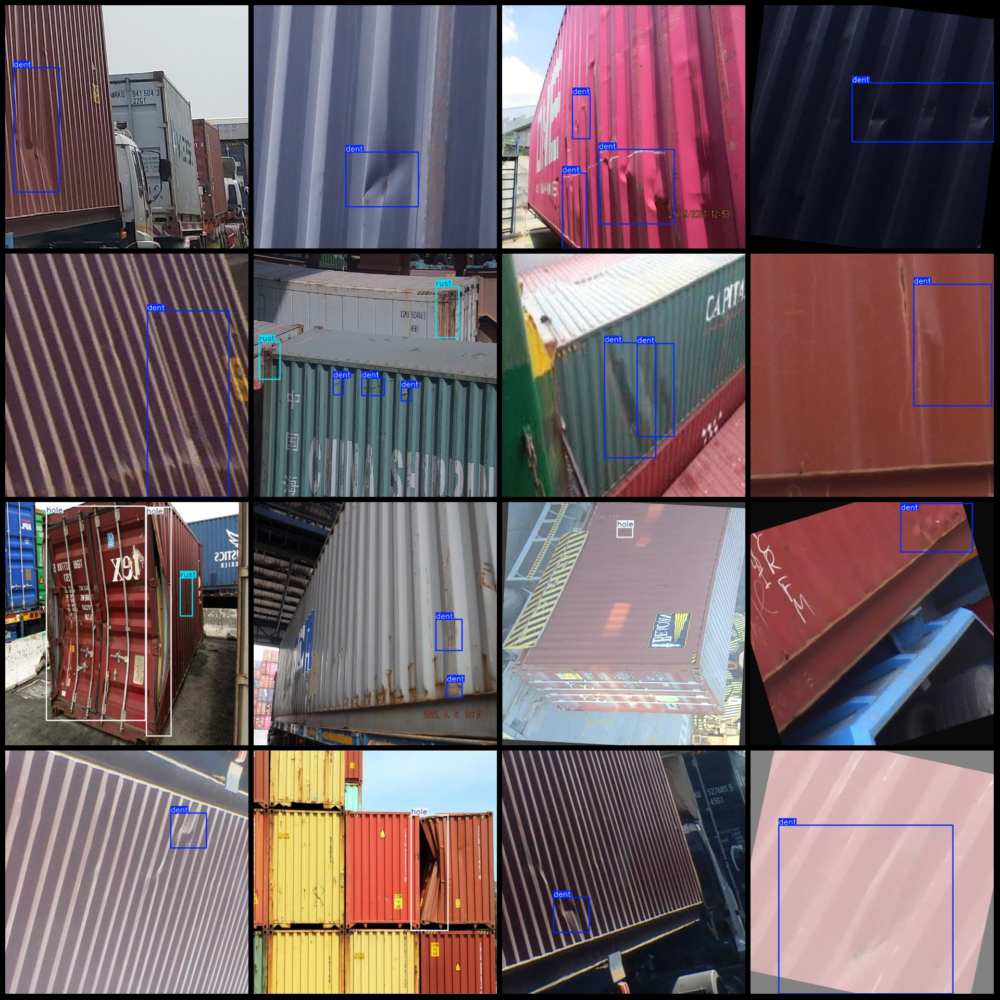
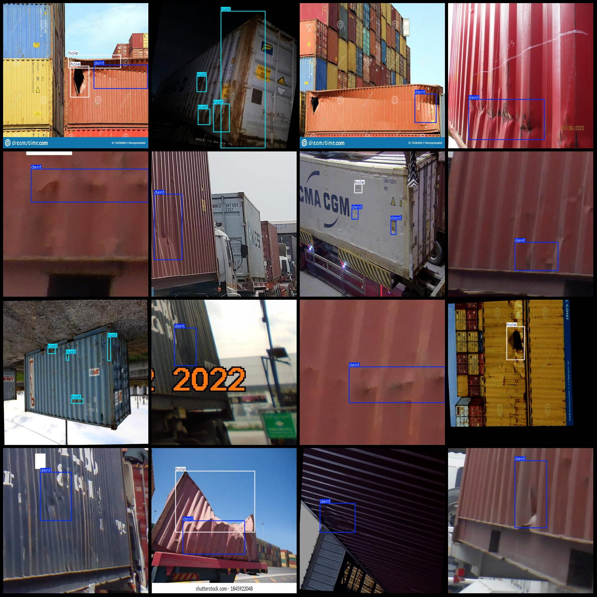

# Intelligent Transportation Container Defects Detection Dataset (VOC+YOLO Format, 1289 Images, 3 Classes)

Please note that some of the images in the dataset have been enhanced.
The dataset format is: Pascal VOC format + YOLO format (without split path txt files, only containing jpg images and corresponding VOC format xml files and yolo format txt files).
Number of images (jpg file counts): 1289
Number of annotations (xml file counts): 1289
Number of annotations (txt file counts): 1289
Number of annotation categories: 3
Annotation category names (note that the order of categories in the yolo format does not match this, but refer to the labels folder 'classes.txt' for consistency): ["dent", "hole", "rust"]
Number of bounding boxes per category:
dent (dinge) = 1086
hole (hole) = 326
rust (rust) = 630
Total bounding box count: 2042
Number of images per category:
dent (dinge) = 850
hole (hole) = 272
rust (rust) = 268
Image resolution: 640x640
Annotation tool used: labelImg
Annotation rules: draw bounding boxes for each category
Important note: The dataset does not have a training/validation/test split and needs to be divided by oneself.
Special declaration: This dataset does not guarantee the accuracy of the trained model or the weight files.
Image preview:
Annotation example:

## Images

Here is a pay link on Stripe ( https://buy.stripe.com/3cs8yP7sY87d0vu9AB ). Please contact me lonlonago@foxmail.com after funding $89, and I will send you a complete data files , thank you!

